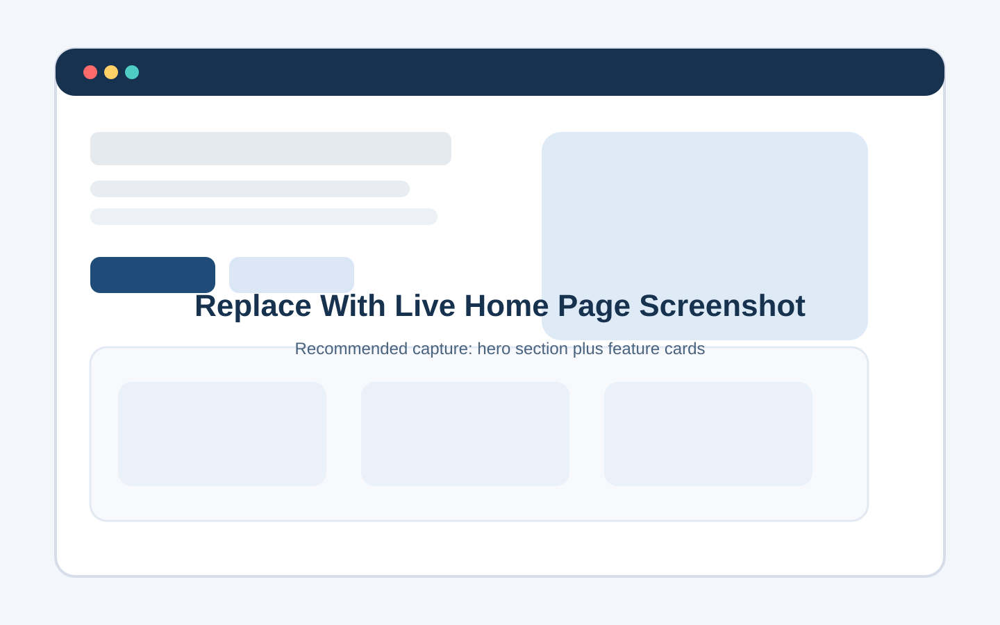
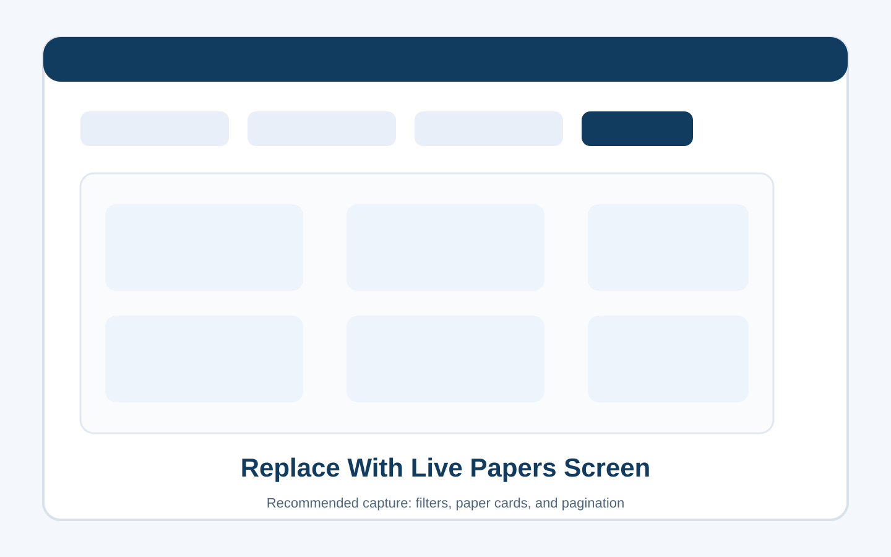
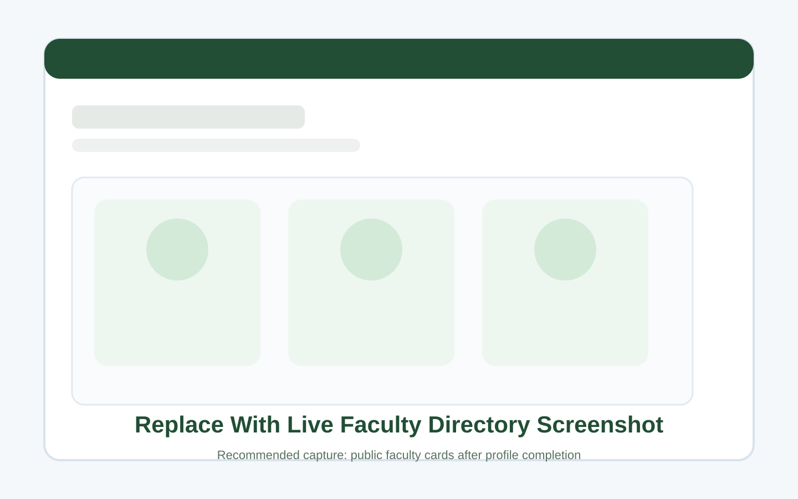
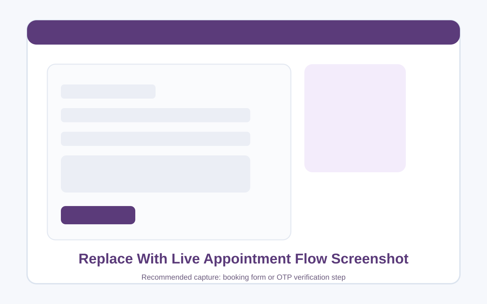
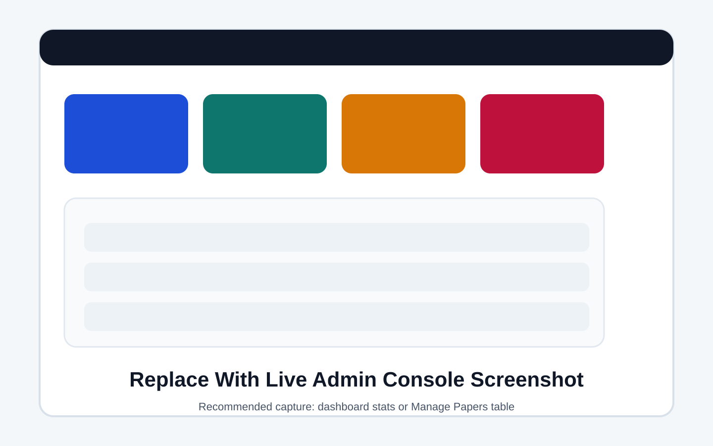

# Campus Toolkit Installation, Usage, and Maintenance Manual

Document version: 1.0  
Prepared on: 2026-04-14

## 1. Purpose

This manual explains how to install, configure, operate, and maintain the Campus Toolkit platform. It is intended for technical staff, project owners, and support personnel who need to set up the application for daily use.

Campus Toolkit provides:

- Previous-year exam paper browsing, filtering, preview, and download
- An attendance shortage calculator
- A public faculty directory
- Student-to-faculty appointment requests with OTP verification
- A faculty dashboard for profile management and appointment handling
- An admin console for dashboard statistics and exam paper maintenance

## 2. System Overview

Campus Toolkit is split into two main applications:

- Frontend: React application in `frontend/`
- Backend: FastAPI application in `backend/`

Supporting services:

- MongoDB for application data
- SMTP or Resend for OTP and appointment email delivery
- Google Drive links for hosted exam paper PDFs

High-level architecture:

```text
React Frontend (port 3000)
        |
        v
FastAPI Backend (port 8000)
        |
        v
     MongoDB

Optional external services:
- SMTP or Resend for email delivery
- Google Drive for paper files
```

## 3. Core Modules

### 3.1 Student Features

- Home page with quick access cards
- Exam paper library with filters and in-app preview
- Attendance calculator
- Faculty directory and faculty profile pages
- Appointment request workflow with OTP verification

### 3.2 Faculty Features

- First-time login with OTP
- Password setup for later logins
- Profile maintenance
- Availability slot management
- Appointment acceptance or rejection with student notification

### 3.3 Admin Features

- Secure admin login using an HTTP-only session cookie
- Dashboard statistics
- Exam paper add, edit, and delete operations

## 4. Prerequisites

Install the following before setup:

- Python 3.10 or later recommended
- Node.js 18 or later recommended
- npm 9 or later recommended
- MongoDB Atlas cluster or a reachable MongoDB deployment
- A valid SMTP account or Resend account for production email delivery

Recommended local ports:

- `3000` for the frontend
- `8000` for the backend

## 5. Repository Layout

```text
project/
|-- backend/
|   |-- app/
|   |-- cli.py
|   |-- main.py
|   |-- requirements.txt
|   `-- .env.example
|-- frontend/
|   |-- src/
|   |-- public/
|   |-- package.json
|   `-- .env.example
|-- tests/
|-- docs/
`-- README.md
```

## 6. Installation and Initial Setup

### 6.1 Backend Setup

From the project root:

```powershell
cd backend
python -m venv .venv
.\.venv\Scripts\Activate.ps1
pip install -r requirements.txt
Copy-Item .env.example .env
```

Edit `backend/.env` and set the required values.

Start the backend:

```powershell
python -m uvicorn main:app --reload --host 0.0.0.0 --port 8000
```

Expected local API base URL:

```text
http://localhost:8000
```

### 6.2 Frontend Setup

Open a second terminal:

```powershell
cd frontend
npm install
Copy-Item .env.example .env
```

Edit `frontend/.env`:

```env
REACT_APP_BACKEND_URL=http://localhost:8000
```

Start the frontend:

```powershell
npm start
```

Expected local UI URL:

```text
http://localhost:3000
```

### 6.3 Create the First Admin User

After the backend is running and MongoDB is reachable:

```powershell
cd backend
python cli.py create-admin
```

The script prompts for:

- Admin email
- Admin name
- Password
- Password confirmation

The new admin can then sign in at:

```text
http://localhost:3000/admin/login
```

## 7. Environment Configuration

### 7.1 Backend Variables

Key backend settings:

| Variable | Required | Purpose |
|---|---|---|
| `MONGO_URI` | Yes | MongoDB connection string |
| `DB_NAME` | Yes | Database name |
| `JWT_SECRET` | Yes | Signs faculty and admin tokens |
| `FRONTEND_ORIGINS` | Yes | Allowed browser origins for CORS |
| `FRONTEND_ORIGIN_REGEX` | No | Regex-based CORS rule |
| `COLLEGE_EMAIL_DOMAIN` | Strongly recommended | Restricts faculty and student flows to academic domains |
| `OTP_DEBUG_MODE` | Yes | Shows OTP values in debug responses when `true` |
| `OTP_TTL_MINUTES` | Yes | Generic OTP expiry window |
| `OTP_RATE_LIMIT_WINDOW_MINUTES` | Yes | OTP throttling window |
| `OTP_RATE_LIMIT_MAX_REQUESTS` | Yes | OTP throttling limit |
| `SMTP_*` | Optional | SMTP delivery settings |
| `RESEND_API_KEY` | Optional | Resend email integration |
| `RESEND_FROM_EMAIL` | Optional | Sender identity for Resend |
| `RESEND_API_BASE` | Optional | Resend API base URL |
| `ADMIN_SESSION_COOKIE_*` | Yes for production tuning | Admin cookie behavior and lifetime |
| `ADMIN_LOGIN_RATE_LIMIT_*` | Yes | Admin login throttling |

### 7.2 Frontend Variables

| Variable | Required | Purpose |
|---|---|---|
| `REACT_APP_BACKEND_URL` | Yes | Backend origin used by the React app |

### 7.3 Important Security Notes

- Set `OTP_DEBUG_MODE=false` outside development environments.
- Use a long random value for `JWT_SECRET`.
- Set `ADMIN_SESSION_COOKIE_SECURE=true` in HTTPS production.
- Review `ADMIN_SESSION_COOKIE_SAMESITE` if frontend and backend are hosted on different domains.
- Define `COLLEGE_EMAIL_DOMAIN` to prevent non-academic email access.

## 8. First-Time Operational Checklist

Complete the following before handing the system to end users:

1. Confirm MongoDB connectivity from the backend.
2. Confirm the frontend can reach `http://localhost:8000/api`.
3. Create at least one admin account.
4. Verify faculty login using an allowed academic email.
5. Complete one faculty profile so the directory shows data.
6. Add sample exam papers from the admin console.
7. Verify OTP delivery using either SMTP, Resend, or debug mode.
8. Test one end-to-end appointment request and faculty response.

## 9. Usage Guide

### 9.1 Student Workflow

#### Home and Navigation

Students can access:

- Home
- Exam Papers
- Attendance Calculator
- Find Faculty
- Request Resources

#### Exam Papers

1. Open `Exam Papers`.
2. Filter by year, department, and subject.
3. Use `View` to preview the PDF.
4. Use `Download PDF` to open the hosted file.

Operational note:

- The admin paper form accepts Google Drive links only.
- The backend validates that the linked file is publicly accessible.

#### Attendance Calculator

1. Enter classes attended.
2. Enter total classes.
3. Enter the required threshold.
4. Select `Calculate`.

The page shows current percentage and, when needed, how many consecutive classes must be attended to reach the target.

#### Faculty Directory and Appointment Booking

1. Open `Find Faculty`.
2. Select a faculty card.
3. Review cabin and available slots.
4. Open `Book Appointment`.
5. Submit the form with academic email and reason.
6. Enter the OTP sent to the student email.
7. Wait for faculty approval or rejection.

Important behavior:

- Unverified appointments are not treated as active faculty appointments.
- Only verified appointments are counted in admin statistics.

### 9.2 Faculty Workflow

#### First Login

1. Open `Faculty Portal`.
2. Enter a valid academic email.
3. If the account has no password yet, verify the OTP.
4. Set a password when prompted.
5. Access the faculty dashboard.

#### Returning Login

1. Open `Faculty Portal`.
2. Enter the same academic email.
3. If a password exists, sign in with the password.

#### Profile Maintenance

Faculty can update:

- Display name
- Department
- Cabin number
- Profile image URL
- Standard availability slots

Only completed profiles are meant to be useful in the public directory.

#### Appointment Handling

Faculty can:

- Review pending appointments
- Accept or reject requests
- Add a message for the student
- Set or confirm meeting time during acceptance

On status change:

- The student receives an appointment status email when delivery is configured
- Accepted appointments create a notification record in MongoDB

### 9.3 Admin Workflow

#### Sign In

1. Navigate to `/admin/login`.
2. Sign in using the admin account created with `cli.py`.
3. The backend sets an HTTP-only session cookie.

#### Dashboard

The admin dashboard shows:

- Total papers
- Faculty profiles
- Verified appointments
- Pending verified appointments

#### Manage Papers

Admins can:

- Add a paper
- Edit a paper
- Delete a paper

Required paper fields:

- Year
- Department
- Subject
- Title
- Type
- Google Drive PDF URL

## 10. Screenshot Section

The screenshot slots below are included so the manual is presentation-ready. In this repository revision they are placeholders and should be replaced with live captures from your deployment before final circulation.

### 10.1 Landing Page



Caption: Capture the home page after at least one faculty profile and one paper have been configured.

### 10.2 Exam Paper Library



Caption: Capture the paper list with filters visible and at least one paper card displayed.

### 10.3 Faculty Directory



Caption: Capture the public faculty listing after profiles are completed.

### 10.4 Appointment Verification Flow



Caption: Capture the booking form or OTP verification step using non-sensitive sample data.

### 10.5 Admin Console



Caption: Capture the admin dashboard or paper management view after sample content is loaded.

## 11. Maintenance Procedures

### 11.1 Routine Maintenance

Perform these tasks regularly:

- Review MongoDB health and storage growth
- Rotate secrets such as `JWT_SECRET`, SMTP credentials, and Resend keys when required
- Confirm OTP delivery is functioning
- Review admin access and deactivate unused accounts directly in MongoDB if needed
- Verify that Google Drive paper links remain public and valid

### 11.2 Paper Content Maintenance

Recommended process:

1. Admin signs in.
2. Open `Manage Papers`.
3. Add or update paper metadata.
4. Use a public Google Drive file URL.
5. Confirm the paper appears in the student view.

### 11.3 Faculty Directory Maintenance

Recommended process:

1. Ask faculty to sign in with their institutional email.
2. Have them complete profile details and availability slots.
3. Review a few public profiles from the student view for formatting quality.

### 11.4 Admin Account Maintenance

To create another admin:

```powershell
cd backend
python cli.py create-admin
```

To deactivate an admin, update the corresponding record in the `admins` collection by setting:

```text
is_active = false
```

### 11.5 Appointment Data Maintenance

Appointments are stored in MongoDB with OTP and status metadata. Periodically review:

- Old unverified appointment records
- Rejected and accepted volume trends
- Faculty slot conflicts

### 11.6 Migration Utility

The repository includes a utility script:

```text
backend/migrate_appointments.py
```

This script renames legacy appointment fields where required. Run it only after reviewing the target database and taking a backup.

## 12. Verification and Testing

### 12.1 Manual Smoke Test

After setup, verify:

1. `GET /` returns the backend welcome payload.
2. `GET /api/papers` returns successfully.
3. `GET /api/faculty` returns successfully.
4. Student paper browsing works.
5. Faculty login works.
6. Admin login works.

### 12.2 Automated Tests

Run backend tests from the project root:

```powershell
python -m pytest
```

Current test coverage in this repository focuses mainly on:

- Admin authentication
- Admin session behavior
- Paper mutation authorization
- Admin statistics
- Selected validation rules

### 12.3 Frontend Build Validation

Run:

```powershell
cd frontend
npm run build
```

Use this before production deployment to confirm the React app compiles correctly.

## 13. Troubleshooting

| Issue | Likely Cause | Recommended Action |
|---|---|---|
| Frontend cannot reach the API | Wrong `REACT_APP_BACKEND_URL` or CORS mismatch | Confirm frontend URL, backend URL, and `FRONTEND_ORIGINS` |
| Faculty login rejects valid-looking email | `COLLEGE_EMAIL_DOMAIN` does not match the real institution domain | Update the environment variable and restart backend |
| OTP email is not received | SMTP or Resend not configured, or `OTP_DEBUG_MODE` disabled in a non-mail setup | Configure mail delivery or use debug mode only for local testing |
| Admin login keeps failing | Admin not created, wrong password, or inactive admin record | Create admin again or verify the `admins` collection |
| Paper creation fails | Non-Google Drive URL or private file | Use a public Google Drive link with "Anyone with the link" access |
| Appointment booking fails for student email | Email does not satisfy the allowed academic domain rules | Update `COLLEGE_EMAIL_DOMAIN` or use a valid academic address |
| Student sees no faculty | Faculty profiles are incomplete or missing | Have faculty log in and complete profiles |

## 14. Known Implementation Note

The frontend `Request Resources` form posts to `/api/requests`, but no matching backend route is present in the current repository revision. Treat that page as incomplete until a backend request endpoint is implemented.

## 15. Production Readiness Checklist

Before going live:

1. Set `OTP_DEBUG_MODE=false`.
2. Use HTTPS.
3. Set `ADMIN_SESSION_COOKIE_SECURE=true`.
4. Use a strong `JWT_SECRET`.
5. Configure reliable mail delivery.
6. Verify MongoDB backups are enabled.
7. Replace screenshot placeholders with live captures.
8. Run `python -m pytest`.
9. Run `npm run build`.

## 16. Support Handover Notes

For a clean handover package, provide:

- Final `.env` values through a secure secret-sharing process
- MongoDB connection ownership details
- SMTP or Resend account ownership details
- At least one working admin account
- A small set of seeded faculty and paper records for demonstrations
- This manual and the project README
